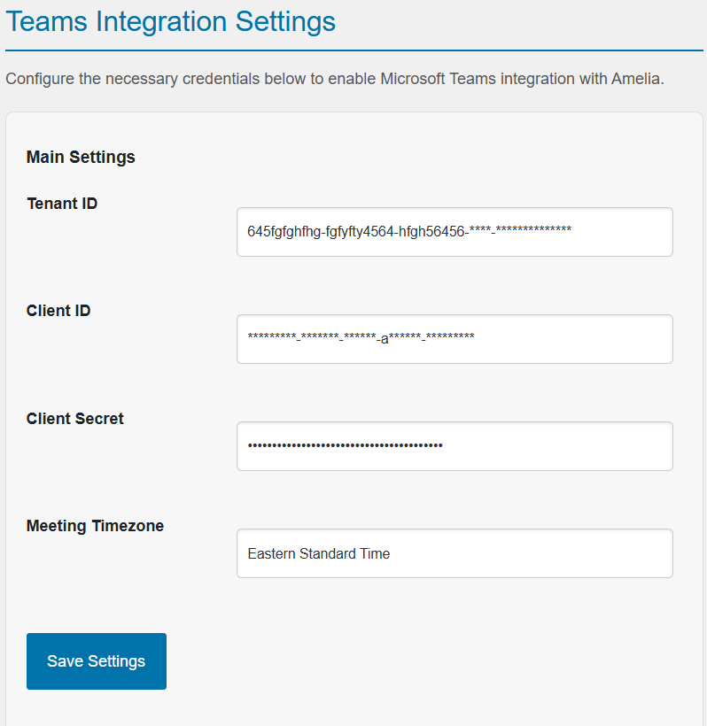

# Teams Integration Plugin for Amelia in WordPress

This WordPress plugin enables seamless integration between **Microsoft Teams** and **Amelia**, allowing automatic creation of Microsoft Teams meeting links for scheduled appointments.

> This plugin is ideal for online businesses, educational institutions, and service providers using Amelia who want to enhance their virtual meeting scheduling with Microsoft Teams integration.

---

## Features

- Microsoft Teams meeting link generation directly from Amelia appointments.
- Azure AD Application integration using Microsoft Graph API.
- Secure configuration using Client ID, Tenant ID, and Client Secret.
- Granular permission setup for Teams, Calendars, Users, and Device Management.
- Troubleshooting tips and testing guidelines included.

---

## Setup Documentation

### 1. Azure Account Setup

1. Visit the [Azure Portal](https://portal.azure.com).
2. Create an account if you don't have one.
3. Select a subscription plan (free tier is sufficient for testing).

### 2. Register Application in Azure Active Directory

1. Go to **Azure Active Directory > App Registrations > + New Registration**.
2. Fill in:
   - **Name:** `TeamsAmeliaIntegration`
   - **Supported account types:** Single tenant (or Multitenant if needed).
   - **Redirect URI:** e.g., `https://yourdomain.com/callback`
3. Click **Register**.

### 3. Generate Client ID, Tenant ID, and Client Secret

- After registration, copy:
  - **Application (Client) ID**
  - **Directory (Tenant) ID**

- Create a **Client Secret**:
  - Go to **Certificates & Secrets > + New Client Secret**
  - Add description, expiry, and copy the generated secret securely.

### 4. Configure Microsoft Graph API Permissions

Grant the following API permissions to the app:

**Calendars Permissions**
- `Calendars.Read`, `Calendars.ReadWrite`, `Calendars.Read.Application`

**Device Management Permissions**
- `DeviceManagementApps.ReadWrite.All`, `DeviceManagementConfiguration.ReadWrite.All`, etc.

**Directory Permissions**
- `Directory.Read.All`, `Directory.ReadWrite.All`

**Online Meetings**
- `OnlineMeetings.Read`, `OnlineMeetings.ReadWrite`, `OnlineMeetings.ReadWrite.All`, `online_access`

**User Profile**
- `User.Read`, `User.Read.All`, `User.ReadWrite.All`

**Click "Grant admin consent"** for your organization after adding the permissions.

### 5. Configure Plugin in WordPress

1. Go to **Teams Integration Settings** in WordPress admin.
2. Enter your:
   - **Client ID**
   - **Tenant ID**
   - **Client Secret**

### 6. Testing the Integration

- Create a test appointment in Amelia.
- Verify that a Microsoft Teams meeting link is generated.
- Confirm link accessibility for attendees.

### 7. Troubleshooting

- **Permissions:** Ensure all required API permissions are granted.
- **Configuration:** Double-check IDs and secret values.
- **Access Token:** Implement a refresh strategy if token expiration occurs.

---

## Folder Structure (if applicable)

```
/teams-amelia-integration
├── includes/
│   └── access-token.php
│   └── add-attendees-to-event.php
│   └── create-db-table.php
│   └── create-event-meeting.php
│   └── delete-event.php
│   └── remove-attendees-to-event.php
│   └── send-notification-to-attendees.php
│   └── setting-options.php
│   └── update-event.php
├── teams-amelia-integration.php
└── README.md
```

---

## Developer Notes

- Developed following WordPress plugin development best practices.
- Secure handling of tokens and credentials.
- Extensible structure for future enhancements (e.g., Teams chat, file sharing).

---

## Screenshot



---

## Contact & Credits

Developed by [The Pro Developer].

For feedback, suggestions, or collaboration, feel free to reach out!

[Email me](mailto:theprodeveloper789@gmail.com)

---

